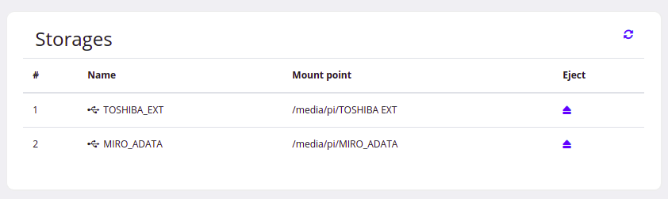

# Network Attached Storage

Táto aplikácia umožňuje prístup k USB úložným zariadeniam prostredníctvom webového rozhrania. Kľúčové funkcionality:
- zoznam pripojených USB úložných zariadení na hostovi
- prístup k zložkám/súborom na vybranom USB úložnom zariadení
- vytváranie nových zložiek na USB úložnom zariadení
- mazanie existujúcich zložiek a súborov na USB úložnom zariadení
- upload súborov na USB úložné zariadenie
- bezpečné odpojenie USB úložného zariadenia na hostovi

# Architektúra aplikácie

# Backend

Aplikáciu som implementoval v jazyku Java s využitím aplikačného frameworku Spring(najmä sub-project SpringBoot) s embedded Tomcat serverom. Aplikácia je určená pre UNIXové systémy, pričom pre manipuláciu so súborovým systémom USB zariadení používa shell poskytnutý hostovacím prostredím(PC/operačný systém, na ktorom je táto aplikácia spustená). Ako vstupné body pre prichádzajúce HTTP požiadavky generované užívateľskou aktivitou vo webovom prehliadači slúžia viaceré kontroléri. Každý kontrolér obsahuje handler metódy, ktoré sú vyvolané v závislosti od atribútov jednotlivých HTTP požiadaviek(napr. HTTP metóda, URI, query parametre, ...), volajú metódy servisnej vrstvy a posielajú získaný model na jednotlivé Views, kvôli renderovaniu stránky.

# Frontend

Frontendová časť je realizovaná prostredníctvom frameworku thymeleaf a v ňom vytvorenej šablóny. Šablóna pozostáva z HTML obohateného o špeciálne výrazy frameworku thymeleaf, štýl šablóny je prispôsobený za pomoci CSS (Bootstrap, Custom). Thymeleaf šablóna pristupuje k dynamickému obsahu prostredníctvom špeciálneho dátového objektu model, ktorý napĺňa kontrolér.

## Zobrazenie pripojených USB úložných zariadení

Základné zobrazenie, obsahuje list pripojených USB úložných zariadení s ich názvami a takisto možnosťou bezpečne odpojiť príslušné USB úložné zariadenie zo súborového systému host prostredia.

## Prechod USB úložným zariadením

Prechádzanie USB úložným zariadením, súbormi a zložkami uloženými na danom zariadení, možnosť vytvárať nové zložky, editovať názov zložiek a súborov, uploadovať súbory, mazať súbory a zložky. Pre každý zobrazený súbor a zložku sú prístupné vybrané atribúty(Size, Type, ...).

